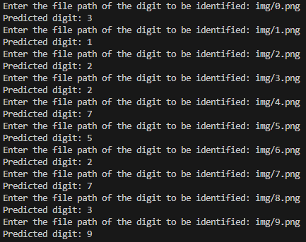

# ece386-lab01

Serving handwritten digit inference with FastAPI.

See [USAFA ECE 386: AI Hardware Applications - Lab 1](https://usafa-ece.github.io/ece386-book/b1-prediction/lab-digits-api.html)

**GitHub Actions are enabled in this repository!** The workflow currently:

- Runs [Black](https://black.readthedocs.io/en/stable/index.html) format checker against client and server
- Runs [Pyright](https://microsoft.github.io/pyright/#/) type checker against client and server

## Writeup

### What strategies did you use to ensure that your client and server where communicating with the same schema?
To make sure that we were communicating with the same schema, we made sure that we were defining the API path to be the same. The requirements for this lab made sure that we were using the */predict* path. So that is what we ended up using. We talked to each other to make sure that it was going to be a POST method for HTTP as well. We then set up the server and client on our own, and then brought them together in class to make sure that they are communicating with each other properly. For the most part, this worked well, and we faced only a small set-back when trying to figure out what data was being sent to the server. 

### In regard to preprocessing your digit images, how well do you think your server would scale to *any* picture of a digit?
This server would not scale well to *any* picture of a digit because the model was trained on a very specific set. Additionally, when we tested the model with images that we created, it performed extremely poorly. It was only able to recognize, correctly, half the images that it was given. 

Given the fact that it is unable to recognize digits that are similar to what it was trained with, there is no chance that this model will be able to predict *any* picture of a digit. 

### Does the client/server architecture make sense for this problem? Why or why not?
The client/server architecture does not make sense for this problem because the processing power required to run this model is rather minute. It is not that extremely complicated of a model that it is necessary to off-load the work to another system. All of this could have been done on one machine easily, which we saw when we had done this model in Google Colab. Colab does not provide an exorbitant amount of processing power, which is further proof that this could have been run on one machine. 

## Documentation

We consulted the documentation for FastAPI, TensorFlow, the Requests library, and Python's built-in JSON module. We also consulted Deepseek R1 on how to properly read a raw bytestream from an HTTP Post request in FastAPI BECAUSE THEIR DOCUMENTATION ALWAYS WANTS TO STEER YOU TO USING THE MULTIPART/FORM-DATA UPLOAD WHEN WE JUST NEED THE OCTET STREAM. This is why NodeJS is better.

We also consulted the python3 documentation to ensure that we were using the input function correctly for the client code.

We also used https://stackoverflow.com/questions/41604263/how-do-i-display-local-image-in-markdown to find how to put an image into a markdown file to make the report look better. It only provided a simple one-liner as to what the code should be. 
